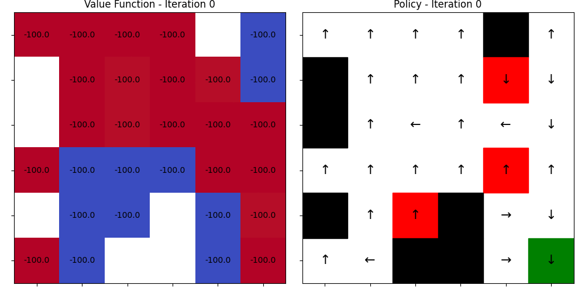
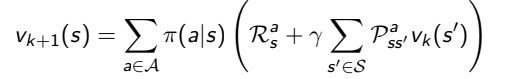
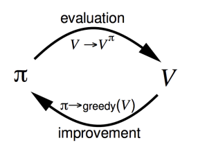
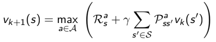

# Practice 1 & 2

Implemented algorithms include:

- **Policy Iteration**
- **Value Iteration**
- **Monte Carlo Control**
- **Temporal-Difference Learning (TD(0))**
- **SARSA**
- **Q-Learning**

---

## 🚀 Training
To train an RL agent, run the `train.py` script with the desired algorithm and optional arguments.
```bash
python train.py --algo {algorithm} [--size SIZE] [--random] [--render]
```
**Arguments**
- --algo (str, required): Choose the learning algorithm.
  - Options: pi, vi, mc, td0, sarsa, q_learning
- --size (int, optional): Width & Height of the GridWorld. Default is 6.
- --render (flag, optional): Render the environment during training.

The trained policy will be saved in the checkpoints/ directory as a .pkl file.




---

## 🖼️ Rendering a Trained Policy
You can visualize a learned policy using the `render.py` script:
```bash
python render.py --policy {path_to_policy.pkl} [--size SIZE] [--random]
```
This will render the agent's behavior following the trained policy in the GridWorld environment.


---

## Algorithms
<details><summary>Dynamic Programing</summary>
## Policy Iteration
**Policy Evaluation**  




## Value Iteration

</details>

---

## 🌍 GridWorld

The GridWorld environment is a 2D grid-based world where each cell can be one of the following types:

- 🟩 **Normal**: The agent can move to a normal cell with a reward of -1.
- 🧱 **Wall**: The agent cannot move into a wall cell. The agent stays in its current position and receives a reward of -1.
- ☠️ **Trap**: If the agent moves into a trap cell, it receives a reward of -100, and the episode ends.
- 🎯 **Goal**: If the agent reaches the goal cell, it receives a reward of 100, and the episode ends.

### 📏 Grid Dimensions

- The grid size can range from **5x5** to **10x10**.

### 🏃‍♂️ Actions

- The agent has 4 possible actions:  
  - ⬆️ **Move Up**  
  - ⬇️ **Move Down**  
  - ⬅️ **Move Left**  
  - ➡️ **Move Right**

---

## 📁 Folder Structure

```bash
.
├── train.py               # Main training script
├── render.py              # Visualization script
├── checkpoints/           # Saved policy files
├── env/                   # GridWorld environment
│   └── maps/              # Predefined map configurations
├── outputs/               # Plotted value tables and action maps
├── venv/                  # Virtual environment folder
├── algos/                 # Folder containing algorithm-related files
└── assets/                # Folder for environment assets (e.g., graphics)

```