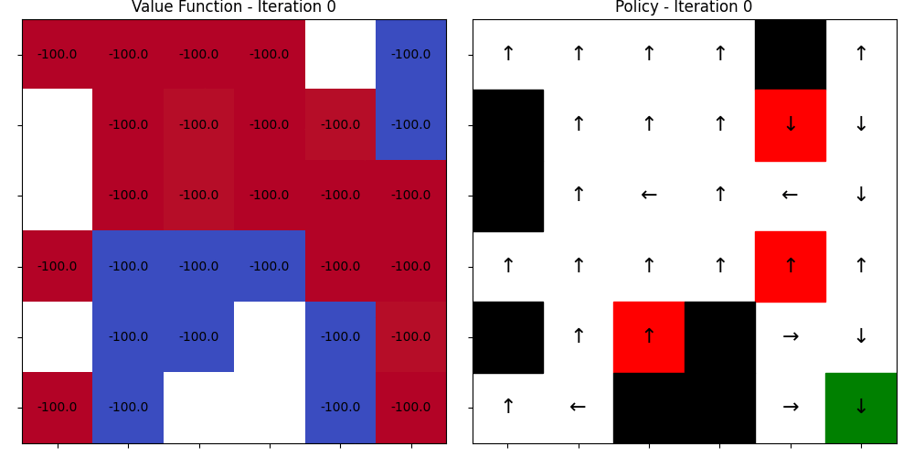

# Reinforcement Learning Algorithms in GridWorld

This repository contains hands-on practice code for reinforcement learning (RL) algorithms, designed to support educational lectures and tutorials. It provides implementations and experiments for key RL methods in a discrete GridWorld environment.

Implemented algorithms include:

- **Policy Iteration**
- **Value Iteration**


---
## Policy Iteration

**Policy Evaluation**  
&space;=&space;\sum_{a&space;\in&space;\mathcal{A}}&space;\pi(a|s)&space;\left(&space;\mathcal{R}_s^a&space;+&space;\gamma&space;\sum_{s'\in&space;\mathcal{S}}&space;\mathcal{P}_{ss'}^a&space;v_k(s')&space;\right)
)


**Policy Improvement**  
=\arg\max_a\sum_{s'}P(s'|s,a)[R(s,a,s')+\gamma&space;V^\pi(s')])


## Value Iteration

=\max_a\sum_{s'}P(s'|s,a)[R(s,a,s')+\gamma&space;V(s')])

=\arg\max_a\sum_{s'}P(s'|s,a)[R(s,a,s')+\gamma&space;V^*(s')])


---

## 🌍 GridWorld

The GridWorld environment is a 2D grid where each cell can be one of the following types:

- 🟩 **Normal**: The agent can move to a normal cell with a reward of -1.
- 🧱 **Wall**: The agent cannot move into a wall cell. The agent stays in its current position and receives a reward of -1.
- ☠️ **Trap**: If the agent moves into a trap cell, it receives a reward of -100, and the episode ends.
- 🎯 **Goal**: If the agent reaches the goal cell, it receives a reward of 100, and the episode ends.

### 📏 Grid Dimensions

- The grid size can range from **5x5** to **10x10**.

### 🏃‍♂️ Actions

- The agent has 4 possible actions:  
  - ⬆️ **Move Up**  
  - ⬇️ **Move Down**  
  - ⬅️ **Move Left**  
  - ➡️ **Move Right**

---

## 🛠️ Installation

We recommend using a virtual environment for package management. This project has been tested on **Ubuntu 20.04** with **Python 3.10**.

```bash
# Clone the repository and navigate to the project folder
cd {project_folder}

# Create and activate a virtual environment
python3.10 -m venv venv
source venv/bin/activate

# Install required packages
pip install pygame numpy matplotlib pillow
```
---

## 🚀 Training
To train an RL agent, run the train.py script with the desired algorithm and optional arguments.
```bash
python train.py --algo {algorithm} [--size SIZE] [--random] [--render]
```
**Arguments**
- --algo (str, required): Choose the learning algorithm.
  - Options: pi, vi
- --size (int, optional): Width & Height of the GridWorld. Default is 6.
- --random (flag, optional): Use randomly generated map.
- --render (flag, optional): Render the environment during training.

The trained policy will be saved in the checkpoints/ directory as a .pkl file.




---

## 🖼️ Rendering a Trained Policy
You can visualize a learned policy using the render.py script:
```bash
python render.py --policy {path_to_policy.pkl} [--size SIZE] [--random]

## 📁 Folder Structure
```bash
.
├── train.py               # Main training script
├── render.py              # Visualization script
├── checkpoints/           # Saved policy files
├── env/                   # GridWorld environment
│   └── maps/              # Predefined map configurations
├── outputs/               # Plotted value tables and action maps
├── venv/                  # Virtual environment folder
├── algos/                 # Folder containing algorithm-related files
└── assets/                # Folder for environment assets (e.g., graphics)

```
---
```
This will render the agent's behavior following the trained policy in the GridWorld environment.
